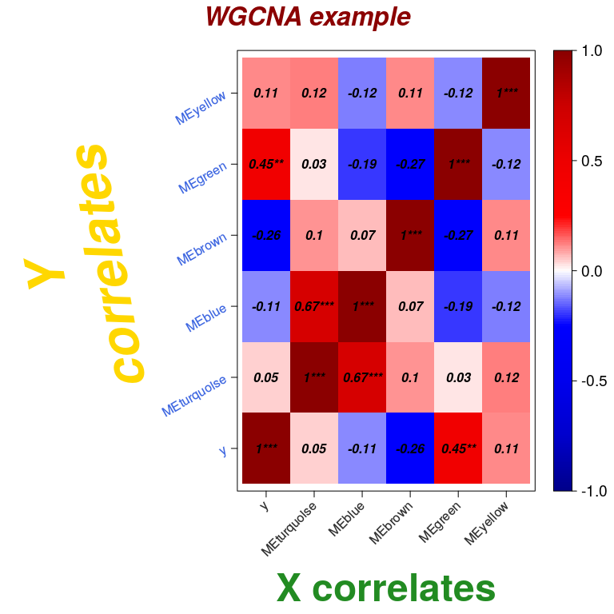
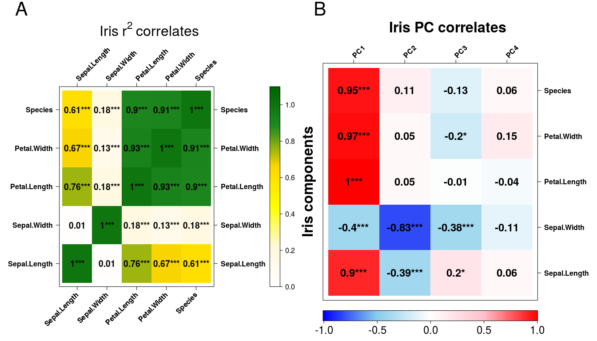

Visualise correlation results and test significancies of these
================
Kevin Blighe
2018-08-25

-   [Example CorLevelPlot plots](#example-corlevelplot-plots)
-   [Example 1: WGCNA (weighted gene co-expression network analysis) simulated data:](#example-1-wgcna-weighted-gene-co-expression-network-analysis-simulated-data)
-   [Example 2: Iris dataset principal components analysis:](#example-2-iris-dataset-principal-components-analysis)
-   [Example 3: World Health Organization (WHO) MONICA data:](#example-3-world-health-organization-who-monica-data)
-   [Acknowledgments](#acknowledgments)
-   [Session info](#session-info)
-   [References](#references)

CorLevelPlot provides a quick and colourful way to visualise statistically significant correlations between any combination of categorical and continuous variables. Moreover, the statistical significancies of these correlations are also provided.

Example CorLevelPlot plots
--------------------------

Install and load CorLevelPlot:

``` r
devtools::install_github("kevinblighe/CorLevelPlot")
library(CorLevelPlot)
```

Example 1: WGCNA (weighted gene co-expression network analysis) simulated data:
-------------------------------------------------------------------------------

The following code taken from [Tutorial for the WGCNA package for R - 1. Simulation of expression and trait data](https://labs.genetics.ucla.edu/horvath/CoexpressionNetwork/Rpackages/WGCNA/Tutorials/Simulated-01-dataSimulation.pdf)

``` r
# simulate trait-to-eigengene data
no.obs <- 50
ESturquoise <- 0
ESbrown <- -0.6
ESgreen <- 0.6
ESyellow <- 0
ESvector <- c(ESturquoise, ESbrown, ESgreen, ESyellow)
nGenes1 <- 3000
simulateProportions1 <- c(0.2, 0.15, 0.08, 0.06, 0.04)
set.seed(1)
MEgreen <- rnorm(no.obs)
scaledy <- MEgreen * ESgreen + sqrt(1 - ESgreen^2) * rnorm(no.obs)
y <- ifelse(scaledy > median(scaledy), 2, 1)
MEturquoise <- ESturquoise * scaledy + sqrt(1 - ESturquoise^2) * rnorm(no.obs)
MEblue <- 0.6 * MEturquoise + sqrt(1 - 0.6^2) * rnorm(no.obs)
MEbrown <- ESbrown * scaledy + sqrt(1 - ESbrown^2) * rnorm(no.obs)
MEyellow <- ESyellow * scaledy + sqrt(1 - ESyellow^2) * rnorm(no.obs)
ModuleEigengeneNetwork1 <- data.frame(y, MEturquoise, MEblue, MEbrown, MEgreen, 
    MEyellow)

CorLevelPlot(data = ModuleEigengeneNetwork1, x = c("y", "MEturquoise", "MEblue", 
    "MEbrown", "MEgreen", "MEyellow"), y = c("y", "MEturquoise", "MEblue", "MEbrown", 
    "MEgreen", "MEyellow"), titleX = "X correlates", cexTitleX = 3, rotTitleX = 0, 
    colTitleX = "forestgreen", fontTitleX = 2, titleY = "Y\ncorrelates", cexTitleY = 4, 
    rotTitleY = 100, colTitleY = "gold", fontTitleY = 4, cexLabX = 1, rotLabX = 45, 
    colLabX = "grey20", fontLabX = 1, cexLabY = 1, rotLabY = 30, colLabY = "royalblue", 
    fontLabY = 1, posLab = "bottomleft", col = c("blue4", "blue3", "blue2", 
        "blue1", "white", "red1", "red2", "red3", "red4"), posColKey = "right", 
    cexLabColKey = 1.2, cexCorval = 1, fontCorval = 4, main = "WGCNA example", 
    scale = FALSE, cexMain = 2, rotMain = 360, colMain = "red4", fontMain = 4, 
    corFUN = "pearson", corUSE = "pairwise.complete.obs", signifSymbols = c("***", 
        "**", "*", ""), signifCutpoints = c(0, 0.001, 0.01, 0.05, 1), colFrame = "white", 
    plotRsquared = FALSE)
```



Example 2: Iris dataset principal components analysis:
------------------------------------------------------

``` r
source("https://bioconductor.org/biocLite.R")
biocLite("datasets")
library(datasets)
data(iris)

# order the categories in the 'Species' column CorLevelPlot will conver
# these to 1, 2, 3, ...
iris$Species <- as.numeric(factor(iris$Species, levels = c("setosa", "versicolor", 
    "virginica")))

i <- CorLevelPlot(data = iris, x = c("Sepal.Length", "Sepal.Width", "Petal.Length", 
    "Petal.Width", "Species"), y = c("Sepal.Length", "Sepal.Width", "Petal.Length", 
    "Petal.Width", "Species"), col = c("white", "cornsilk1", "yellow", "gold", 
    "forestgreen", "darkgreen"), cexCorval = 1.2, fontCorval = 2, posLab = "all", 
    rotLabX = 45, scale = TRUE, main = bquote(Iris ~ r^2 ~ correlates), plotRsquared = TRUE)

pca <- stats::prcomp(iris[, c("Sepal.Length", "Sepal.Width", "Petal.Length", 
    "Petal.Width")])
df <- data.frame(pca$x, iris)

ii <- CorLevelPlot(data = df, x = c("PC1", "PC2", "PC3", "PC4"), y = c("Sepal.Length", 
    "Sepal.Width", "Petal.Length", "Petal.Width", "Species"), cexTitleX = 2, 
    rotTitleX = 0, fontTitleX = 2, titleY = "Iris components", cexTitleY = 2, 
    rotTitleY = 90, fontTitleY = 2, posLab = "topright", col = c("blue1", "skyblue", 
        "white", "pink", "red1"), posColKey = "bottom", cexLabColKey = 1.5, 
    cexCorval = 1.5, fontCorval = 2, rotLabX = 45, scale = TRUE, main = "Iris PC correlates", 
    colFrame = "white", plotRsquared = FALSE)

require(rasterVis)
require(gridExtra)
require(grid)

grid.arrange(arrangeGrob(i, top = textGrob("A", x = unit(0.05, "npc"), y = unit(0.9, 
    "npc"), just = c("left", "top"), gp = gpar(fontsize = 32))), arrangeGrob(ii, 
    top = textGrob("B", x = unit(0.05, "npc"), y = unit(0.9, "npc"), just = c("left", 
        "top"), gp = gpar(fontsize = 32))), ncol = 2)
```



Example 3: World Health Organization (WHO) MONICA data:
-------------------------------------------------------

``` r
biocLite("DAAG")
library(DAAG)
data(monica)

# order the categorical variables
monica$outcome <- as.numeric(factor(monica$outcome, levels = c("dead", "live")))

monica$diabetes[monica$diabetes == "nk"] <- NA
monica$diabetes <- as.numeric(factor(monica$diabetes, levels = c("n", "y")))

monica$hichol[monica$hichol == "nk"] <- NA
monica$hichol <- as.numeric(factor(monica$hichol, levels = c("n", "y")))

monica$stroke[monica$stroke == "nk"] <- NA
monica$stroke <- as.numeric(factor(monica$stroke, levels = c("n", "y")))

monica$sex <- as.numeric(factor(monica$sex, levels = c("m", "f")))

monica$yronset <- as.numeric(factor(monica$yronset, levels = c("85", "86", "87", 
    "88", "89", "90", "91", "92", "93")))

monica$highbp[monica$highbp == "nk"] <- NA
monica$highbp <- as.numeric(factor(monica$highbp, levels = c("n", "y")))

monica$angina[monica$angina == "nk"] <- NA
monica$angina <- as.numeric(factor(monica$angina, levels = c("n", "y")))

monica$hosp <- as.numeric(factor(monica$hosp, levels = c("n", "y")))

CorLevelPlot(data = monica, x = c("outcome", "diabetes", "highbp", "hichol", 
    "angina", "hosp"), y = c("sex", "age", "yronset"), col = c("darkblue", "blue2", 
    "black", "red2", "darkred"), cexCorval = 1.5, colCorval = "white", fontCorval = 2, 
    posLab = "bottomleft", rotLabX = 45, posColKey = "top", cexLabColKey = 1.2, 
    scale = TRUE, main = "World Health Organization", colFrame = "white", plotRsquared = FALSE)
```


Acknowledgments
---------------

The development of *CorLevelPlot* has benefited from contributions and suggestions from:

[Myles Lewis](https://www.qmul.ac.uk/whri/people/academic-staff/items/lewismyles.html)

Session info
------------

``` r
sessionInfo()
```

    ## R version 3.5.1 (2018-07-02)
    ## Platform: x86_64-pc-linux-gnu (64-bit)
    ## Running under: Ubuntu 16.04.5 LTS
    ## 
    ## Matrix products: default
    ## BLAS: /usr/lib/atlas-base/atlas/libblas.so.3.0
    ## LAPACK: /usr/lib/atlas-base/atlas/liblapack.so.3.0
    ## 
    ## locale:
    ##  [1] LC_CTYPE=pt_BR.UTF-8       LC_NUMERIC=C              
    ##  [3] LC_TIME=en_GB.UTF-8        LC_COLLATE=pt_BR.UTF-8    
    ##  [5] LC_MONETARY=en_GB.UTF-8    LC_MESSAGES=pt_BR.UTF-8   
    ##  [7] LC_PAPER=en_GB.UTF-8       LC_NAME=C                 
    ##  [9] LC_ADDRESS=C               LC_TELEPHONE=C            
    ## [11] LC_MEASUREMENT=en_GB.UTF-8 LC_IDENTIFICATION=C       
    ## 
    ## attached base packages:
    ## [1] grid      stats     graphics  grDevices utils     datasets  methods  
    ## [8] base     
    ## 
    ## other attached packages:
    ##  [1] DAAG_1.22            gridExtra_2.3        rasterVis_0.45      
    ##  [4] latticeExtra_0.6-28  RColorBrewer_1.1-2   lattice_0.20-35     
    ##  [7] raster_2.6-7         sp_1.3-1             BiocInstaller_1.31.3
    ## [10] CorLevelPlot_0.99.0  knitr_1.20          
    ## 
    ## loaded via a namespace (and not attached):
    ##  [1] Rcpp_0.12.17      magrittr_1.5      devtools_1.13.6  
    ##  [4] viridisLite_0.3.0 R6_2.2.2          stringr_1.3.1    
    ##  [7] httr_1.3.1        highr_0.7         tools_3.5.1      
    ## [10] parallel_3.5.1    gtable_0.2.0      git2r_0.23.0     
    ## [13] withr_2.1.2       htmltools_0.3.6   yaml_2.1.19      
    ## [16] rprojroot_1.3-2   digest_0.6.15     formatR_1.5      
    ## [19] curl_3.2          memoise_1.1.0     evaluate_0.10.1  
    ## [22] rmarkdown_1.10    stringi_1.2.3     compiler_3.5.1   
    ## [25] backports_1.1.2   hexbin_1.27.2     zoo_1.8-3

References
----------

(Blighe 2018)

Blighe, Kevin. 2018. “CorLevelPlot: Visualise correlation results and test significancies of these.” <https://github.com/kevinblighe>.
